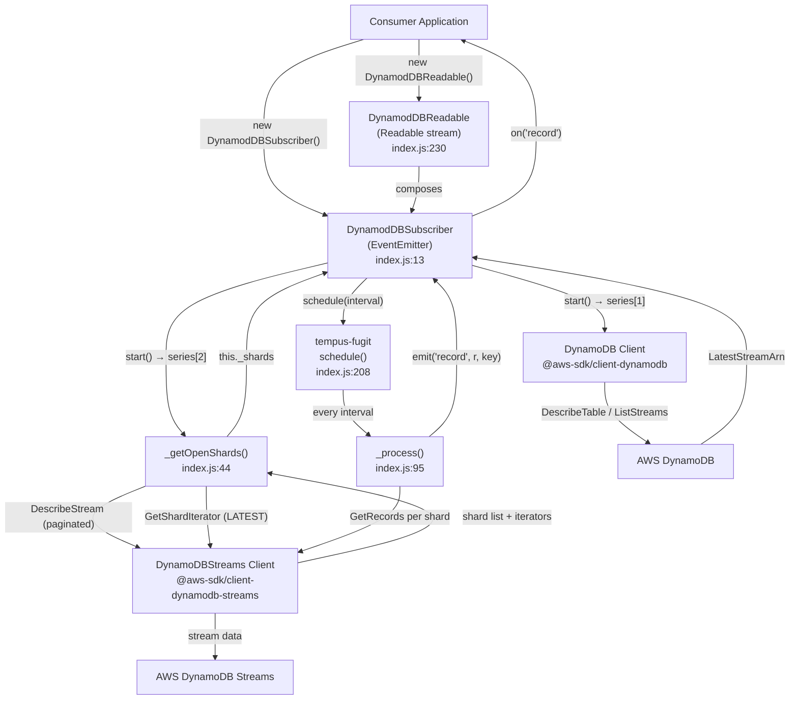
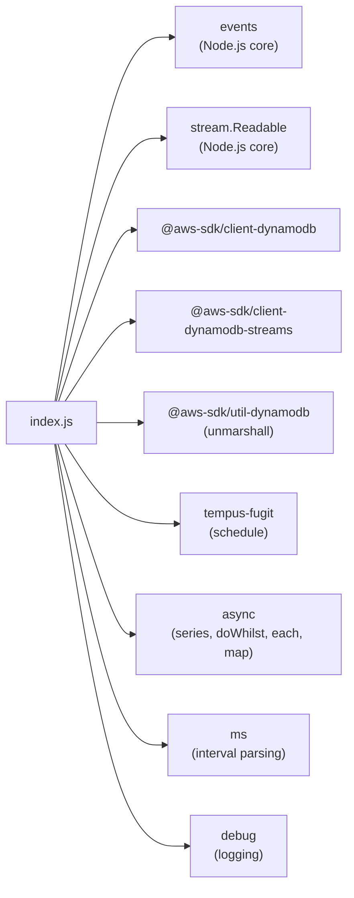
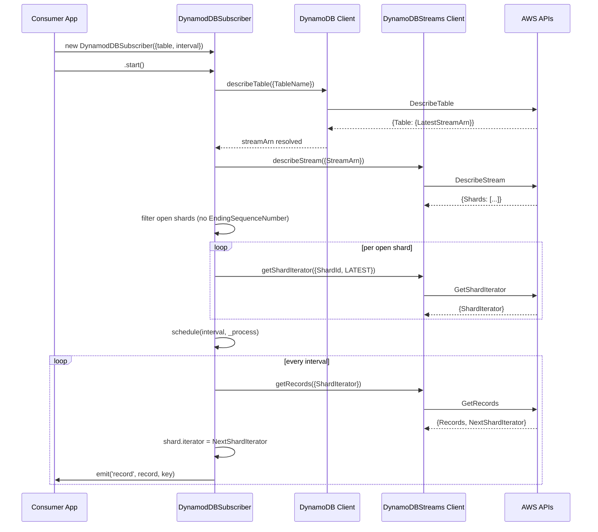
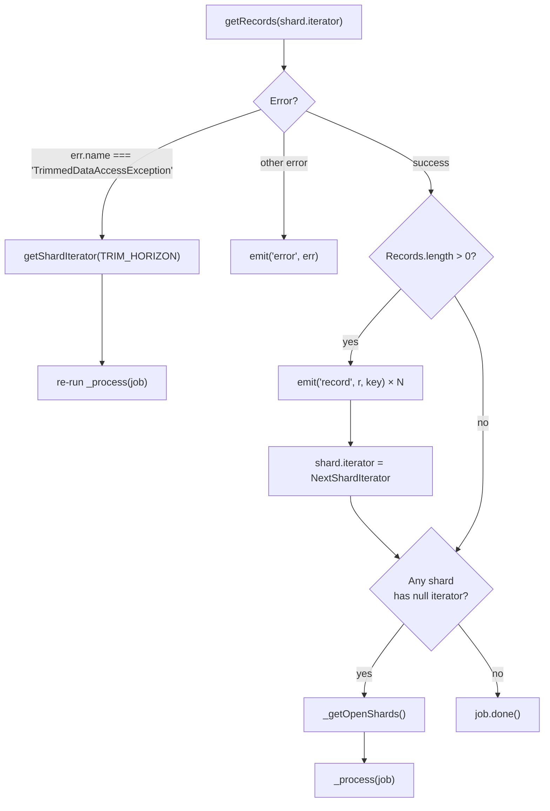
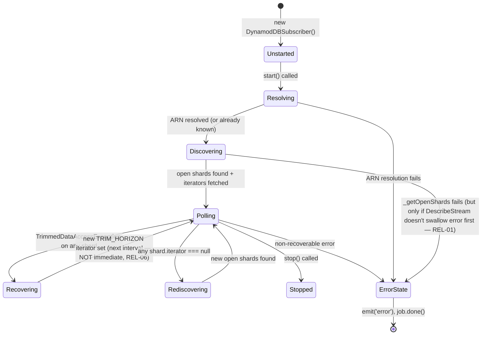

# Architecture
**Project:** `@replicon/dynamodb-subscriber` v1.7.2
**Confidence:** High
**Generated:** 2026-08-04

---

## Architectural Style

**Single-module library** following the **EventEmitter + Adapter** pattern. No multi-layer separation — all logic resides in one file (`index.js`, 252 lines). The design mirrors the standard Node.js core pattern: extend a base class (`EventEmitter`, `Readable`) and encapsulate protocol details internally.

The library is **not** a backend application, REST service, or CLI — it is a pure library with no entry point of its own. Callers initialize it and receive events.

---

## Architectural Layers

```
┌─────────────────────────────────────────────────────────┐
│  Layer 1: Public API                                    │
│  DynamodDBSubscriber (EventEmitter)  index.js:13        │
│  DynamodDBReadable (Readable stream) index.js:230       │
├─────────────────────────────────────────────────────────┤
│  Layer 2: Polling Engine                                │
│  tempus-fugit scheduler + _process() index.js:95,208   │
├─────────────────────────────────────────────────────────┤
│  Layer 3: Shard Management                              │
│  _getOpenShards()                    index.js:44        │
├─────────────────────────────────────────────────────────┤
│  Layer 4: AWS SDK Integration                           │
│  DynamoDBStreams client               index.js:34–41    │
│  DynamoDB client (ARN discovery)      index.js:166–172  │
└─────────────────────────────────────────────────────────┘
```

Layer violations: **None** — layer direction is consistent (API → Engine → Shard Mgmt → AWS SDK).

---

## High-Level System Architecture



---

## Module Dependency Graph



- **Hub file:** `index.js` is the sole source file — it imports everything.
- **Leaf files:** All dependencies are terminal (they do not import from `index.js`).
- **Circular dependencies:** None.

---

## Sequence Diagram — Full Startup and First Record



---

## Error Recovery Architecture



---

## Design Patterns Detected

| Pattern | Where | Verdict |
|---------|-------|---------|
| **Observer / EventEmitter** | `DynamodDBSubscriber extends EventEmitter` | Correctly implemented — consumers call `on('record')` |
| **Adapter** | `DynamodDBReadable` wrapping `DynamodDBSubscriber` | Correctly adapts EventEmitter to Readable stream interface |
| **Template Method** | `Readable._read()` → `subscriber.start()` | Correctly deferred — `_read` is called by Node.js stream internals |
| **Polling** | `tempus-fugit schedule()` + `_process()` | Standard polling loop |
| **Async Waterfall (inline)** | `async.series` in `start()` | Sequential initialization steps — appropriate use |
| **Async Parallel** | `async.each` in `_process()`, `async.map` in `_getOpenShards()` | Parallel shard processing — correct |

**Anti-patterns detected:**

| Anti-pattern | Where | Description |
|-------------|-------|-------------|
| **Callback Hell** | `_getOpenShards()` lines 46–92 | 5 levels of nesting — readable but fragile |
| **Error Swallowing** | `index.js:55` | `describeStream` error is `console.log`'d but never propagated — callback never called |
| **Inconsistent async** | Throughout | `async` library (callback-based) used alongside ES6 classes; no Promises or async/await |
| **Adapter partially broken** | `DynamodDBReadable` index.js:236–239 | Backpressure stops the subscriber but there is no resume path — stream stalls permanently after first backpressure event (cross-validation correction: originally marked "correctly implemented") |
| **Wrong result-collection primitive** | `index.js:98,134` | `async.each` is used to collect a `rerunJob` flag, but `async.each` discards iterator results — `rerunJob` is always `undefined` (see REL-06) |

---

## Deep-Dive: Subscriber Lifecycle State Machine

The `DynamodDBSubscriber` has an implicit lifecycle state machine that is not documented anywhere:



**Dead state (hidden):** If `DescribeStream` errors (REL-01), the state machine freezes between `Discovering` and `Polling` with no way out.

## Deep-Dive: Multiple `start()` / `_read()` Race Condition

**Finding:** Neither `start()` nor `DynamodDBReadable._read()` guard against being called multiple times.

- If `start()` is called twice, two separate `tempus-fugit` jobs are created (two polling loops on the same shards). Records will be emitted twice.
- `DynamodDBReadable._read()` calls `subscriber.start()`. Node.js calls `_read()` every time the stream's internal buffer drains. If the consumer is fast and the stream buffer drains frequently, multiple `start()` calls accumulate multiple schedulers.
- **File:** `index.js:244–246` — no guard on `_read()`; `index.js:161` — no guard on `start()`

**Recommended fix:** Add an `_started` flag:
```javascript
start() {
  if (this._started) return;
  this._started = true;
  // ... existing logic
}
```

## Deep-Dive: Debug Log Bug

**Finding:** At `index.js:65`, the debug log inside `_getOpenShards` reads:
```javascript
debug('stream.getShardIterator (start) ShardId: %s', openShards.length);
```
It logs `openShards.length` (a number) instead of `shard.ShardId` (the current shard being iterated). This renders the debug output for this step meaningless — every shard logs the same total count instead of its own ID.

**Fix:** Change to `shard.ShardId`.

## Techniques Applied

- Layer Detection Analysis (#1): Identified 4 architectural layers
- Module Boundary Mapping (#2): Traced inter-module dependencies
- Dependency Graph Construction (#3): Built Mermaid dependency graph
- Design Pattern Recognition (#4): Identified Observer, Adapter, Template Method, and anti-patterns
- Entry Point Discovery (#5): Located both exported classes
- Event Flow Analysis (#8): Mapped the full event lifecycle
- Error Propagation Tracing (#10): Mapped all error paths including the swallowed error
- Input-to-Output Tracing (#6) [deep-dive]: Produced state machine for subscriber lifecycle
- Async Flow Analysis (#48) [deep-dive]: Identified multiple-start race and async.each result-discard bug
