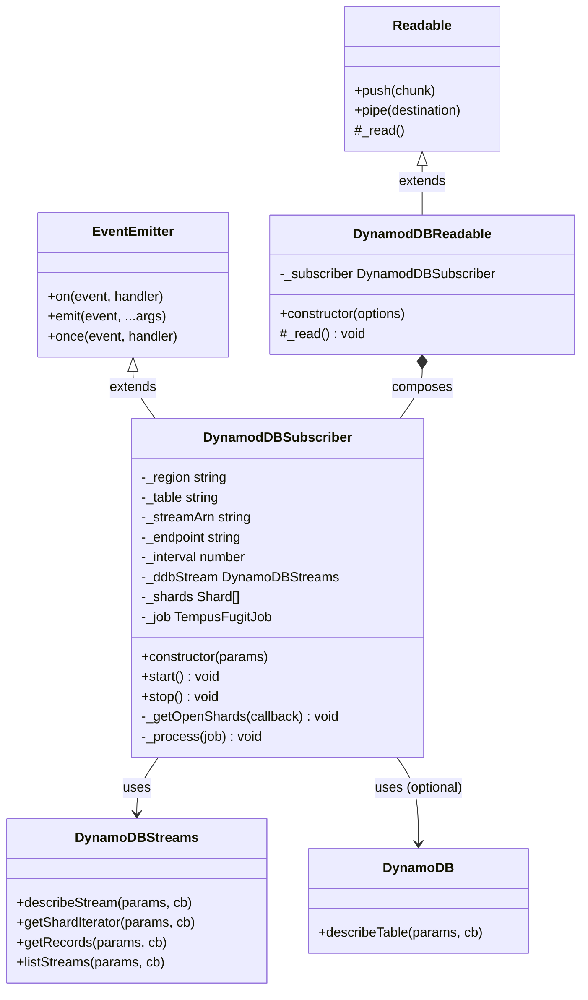

# Component Inventory
**Project:** `@replicon/dynamodb-subscriber` v1.7.2
**Confidence:** High
**Generated:** 2026-08-04

---

## Overview

The library has **2 public classes** and **4 core methods**. All code lives in `index.js` — there are no separate modules, services, or utility files.

---

## Class Inventory

### `DynamodDBSubscriber`

| Attribute | Value |
|-----------|-------|
| **File** | `index.js:13` |
| **Extends** | `EventEmitter` (Node.js `events`) |
| **Type** | Core class — primary public interface |
| **Responsibility** | Manages the full DynamoDB stream subscription lifecycle: ARN resolution, shard discovery, periodic polling, record emission, error recovery |

**Fields:**

| Field | Set At | Type | Purpose |
|-------|--------|------|---------|
| `_region` | constructor | `string` | AWS region for SDK clients |
| `_table` | constructor | `string` | DynamoDB table name (if provided) |
| `_streamArn` | constructor / `start()` | `string` | Resolved stream ARN |
| `_endpoint` | constructor | `string` | Custom AWS endpoint (for local DynamoDB) |
| `_interval` | constructor | `number` | Polling interval in milliseconds |
| `_ddbStream` | constructor | `DynamoDBStreams` | Streams SDK client (created once, reused) |
| `_shards` | `_getOpenShards()` | `Shard[]` | Current list of open shards with iterators |
| `_job` | `start()` | `TempusFugitJob` | Reference to the running polling job |

**Methods:**

| Method | Visibility | Calls | Called By |
|--------|-----------|-------|-----------|
| `constructor(params)` | public | `DynamoDBStreams()`, `DynamoDB()` (conditional) | Consumer |
| `start()` | public | `DynamoDB.describeTable`, `DynamoDBStreams.listStreams`, `_getOpenShards`, `schedule` | Consumer |
| `stop()` | public | `this._job.cancel()` | Consumer |
| `_getOpenShards(cb)` | private | `DynamoDBStreams.describeStream`, `DynamoDBStreams.getShardIterator` | `start()`, `_process()` |
| `_process(job)` | private | `DynamoDBStreams.getRecords`, `_getOpenShards`, `emit` | `tempus-fugit` scheduler |

---

### `DynamodDBReadable`

| Attribute | Value |
|-----------|-------|
| **File** | `index.js:230` |
| **Extends** | `stream.Readable` (Node.js `stream`) |
| **Type** | Adapter class — secondary public interface |
| **Responsibility** | Adapts `DynamodDBSubscriber` to the Node.js Readable stream interface; handles backpressure |

**Fields:**

| Field | Set At | Type | Purpose |
|-------|--------|------|---------|
| `_subscriber` | constructor | `DynamodDBSubscriber` | The composed subscriber instance |

**Methods:**

| Method | Visibility | Description |
|--------|-----------|-------------|
| `constructor(options)` | public | Creates `DynamodDBSubscriber`, wires `'record'` and `'error'` events to stream push and emit |
| `_read()` | override | Called by Node.js internals when consumer is ready — triggers `subscriber.start()` |

---

## Component Relationship Diagram

---

## Event Listener Inventory

| Emitter | Event | Listener | File:Line | Notes |
|---------|-------|----------|-----------|-------|
| `DynamodDBSubscriber` | `'record'` | Consumer app | (external) | Library emits, consumer listens |
| `DynamodDBSubscriber` | `'error'` | Consumer app | (external) | Must be attached or process crashes |
| `DynamodDBSubscriber` | `'record'` | `DynamodDBReadable` | `index.js:236` | Internal adapter listener |
| `DynamodDBSubscriber` | `'error'` | `DynamodDBReadable` | `index.js:240` | Re-emits on the Readable stream |

**Orphaned listeners:** None detected — all listeners are purposeful.

**Fire-and-forget patterns:** None — all events have expected listeners in normal use.

---

## AWS API Calls Inventory

| Method | AWS API Call | Params | Called From |
|--------|-------------|--------|-------------|
| `start()` | `DynamoDB.describeTable` | `{TableName}` | `index.js:174` |
| `start()` | `DynamoDBStreams.listStreams` | `{TableName}` | `index.js:188` |
| `_getOpenShards()` | `DynamoDBStreams.describeStream` | `{StreamArn, ExclusiveStartShardId?}` | `index.js:49` |
| `_getOpenShards()` | `DynamoDBStreams.getShardIterator` | `{StreamArn, ShardId, ShardIteratorType: 'LATEST'}` | `index.js:67` |
| `_process()` | `DynamoDBStreams.getRecords` | `{ShardIterator}` | `index.js:100` |
| `_process()` → TrimmedDataAccessException recovery | `DynamoDBStreams.getShardIterator` | `{StreamArn, ShardId, ShardIteratorType: 'TRIM_HORIZON'}` | `index.js:103` |

---

## Scheduler Component

| Component | Package | Version | Usage |
|-----------|---------|---------|-------|
| `tempus-fugit schedule()` | `tempus-fugit` | ~2.3.1 | Creates the polling job at `index.js:208–211`. Returns a `job` object with `.cancel()` method. The job callback receives the `job` itself and must call `job.done()` when each poll cycle is complete. |

---

## Deep-Dive: `tempus-fugit` Contract and Implicit Invariants

The relationship between `_process(job)` and `tempus-fugit` relies on an undocumented contract:

1. `tempus-fugit` fires `_process(job)` at each `interval`
2. `_process` must call `job.done()` exactly once to signal completion and allow the next scheduled firing
3. If `job.done()` is not called (e.g. due to REL-01 hang), the scheduler is blocked — no future intervals fire
4. `_process` recursively calls itself (via `this._process(job)`) during shard re-discovery, deferring `job.done()` until the recursive chain completes

**Invariant:** `job.done()` must be called on exactly every code path in `_process`. If any path misses it, the library silently stops polling forever.

**Current `job.done()` coverage:**
| Path | `job.done()` Called? |
|------|---------------------|
| Normal completion | ✓ (`index.js:157`) |
| Error in `async.each` | ✓ (`index.js:137`) |
| Error in re-discovered `_getOpenShards` | ✓ (`index.js:151`) |
| Shard re-discovery → recursive `_process` | Deferred — called when recursion completes ✓ |
| Hang due to REL-01 in `_getOpenShards` | ✗ — never called, scheduler permanently blocked |

## Deep-Dive: `DynamoDBStreams` Client Reuse vs. `DynamoDB` Client Ephemeral Creation

| Client | Created | Reused | Notes |
|--------|---------|--------|-------|
| `DynamoDBStreams` | Once in constructor (`index.js:34–41`) | Across all polls — singleton | Correct pattern |
| `DynamoDB` | Every `start()` call (`index.js:166–172`) | No — new instance per call | Inefficient if `start()` is called multiple times (REL-07). Should be created once in constructor when `table` is provided |

## Techniques Applied

- Module Boundary Mapping (#2): Mapped all inter-component dependencies
- Event Flow Analysis (#8): Full event emitter inventory
- Third-Party SDK Inventory (#38): All AWS SDK calls catalogued
- Message Queue Analysis (#36): N/A — no message queues used
- Data Transformation Chain (#9) [deep-dive]: `tempus-fugit` contract and `job.done()` coverage analysis
- Async Flow Analysis (#48) [deep-dive]: DynamoDBStreams vs DynamoDB client lifecycle analysis

---

## Techniques Applied

- Module Boundary Mapping (#2): Mapped all inter-component dependencies
- Event Flow Analysis (#8): Full event emitter inventory
- Third-Party SDK Inventory (#38): All AWS SDK calls catalogued
- Message Queue Analysis (#36): N/A — no message queues used
